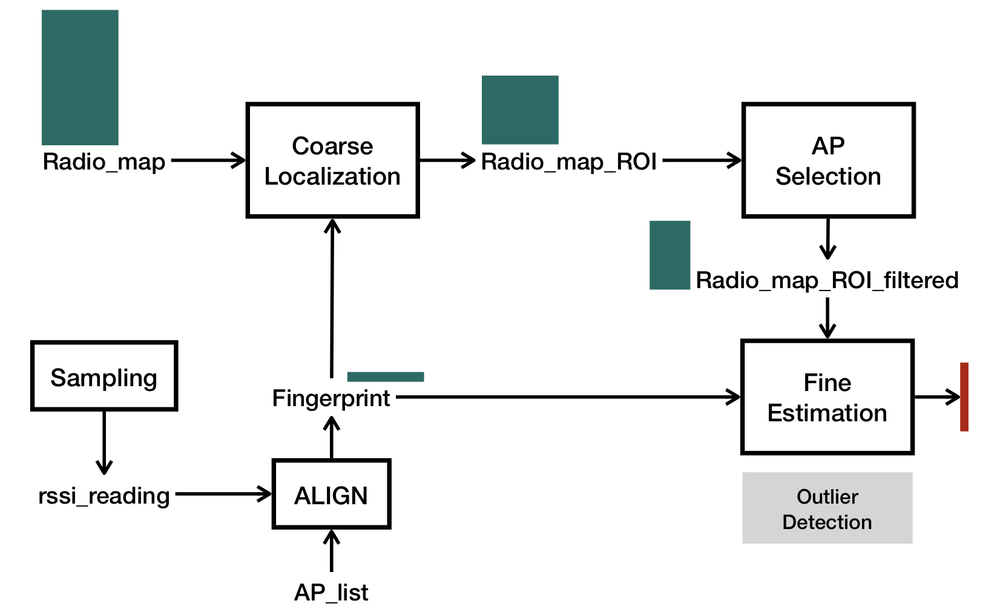
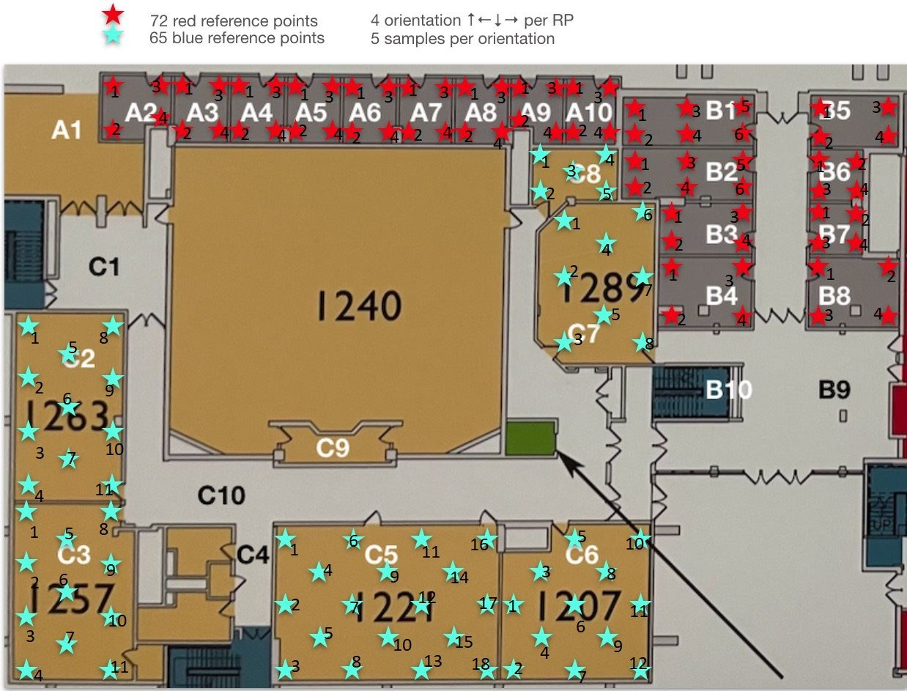

### WIFI-Fingerprint Based Localization

----

#### i. System overview



#### ii. Directory

```
├── README.md
├── config.json
├── demo.py
├── preprocess
│   ├── (RPs.pkl)
│   ├── (cluster.json)
│   ├── gen_lib.ipynb
│   ├── (meta.json)
│   ├── (test.pkl)
│   └── (train.pkl)
├── raw_data
│   └── 2023_1
│       └── *.json
├── rssicore
│   ├── APselector.py
│   ├── Estimate.py
│   ├── RPcluster.py
│   ├── Sampler.py
│   ├── Utils.py
│   └── __init__.py
└── sampling_util
    ├── ipynb
    │   └── autoRecorder.ipynb
    ├── README.md
    ├── recorder.py
    └── recorder_ubuntu.py
```

`./demo.py `  a simple implementation of the above system 

`./config.json`  config file used by demo.py

`sampling_util/`  WiFi RSSI sampler, works under macOS and ubuntu -  **SAMPLING** block

`raw_data/`  raw WiFi RSSI files in the format of json sampled in CS building first floor, with a floor map of following:



`preprocess/`  process raw RSSI files into usable database - **ALIGN** block

`rssi_core/`  core component lib used by `demo.py` - **COARSE LOCALIZATION**, **AP SELECTION**, **FINE ESTIMATION** blocks

#### iii. Quick Start

- Sample and label WiFi RSSI data with `sampling_util/` , read `sampling_util/README.md` for guidance.

- Process sampled json files using `preprocess/gen_lib.ipynb` , you will get `RPs.pkl` as reference points dataset and `meta.json` as AP index for fingerprint, together with other data.

- Write your own `config.json` specify dataset and other configs.

  - ```
    {
        "PLATFORM" : "macos",                // macos, linux, or simulation if you want to use file stream
    
        "SRC_PATH" : "preprocess/",          // path to looking for the followed file
        "RP_PKL" : "RPs.pkl",                // dataset used for reference points
        "RP_META" : "meta.json",             // meta data
        "PRE_CLUSTERED" : "cluster.json",    // cluster info, cluster can be perform in advance.
        
        "SAMPLE_INTERVAL" : 0,               // sample interval when perform online localization
        "SAMPLE_FILE" : "preprocess/test.pkl",  // specify the file name if it is a simulation
        "LOC_INTERVAL": 1,                   // interval when perform localization
    
        "RP_CLUSTER_ALG" : "mono",           // RP cluster algorithm, "mono" means only one whole cluster
        "COARSE_LOC_ALG" : "useall",         // algorithm for coarse localization, i.e. RP selection
        "AP_SELECT_ALG" : "naive",           // algorithm for AP selection
        "DISCRETE_ALG" : "all"               // algorithm for fine estimation
    }
    ```

- `$ python3 demo.py config.json`


